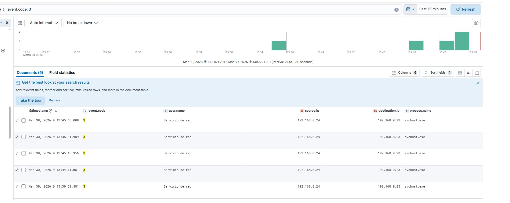

# 🔐 RDP Brute Force Detection – SOC Lab

## 🧪 Lab Overview

This lab simulates a brute force attack against an exposed RDP service and demonstrates how to detect suspicious activity using Elastic Stack and Sysmon.

---

## 💻 Environment

* **Attacker**: Kali Linux (192.168.0.24)
* **Victim**: Windows Machine (192.168.0.23)
* **SIEM**: Elastic Stack (Kibana)
* **Telemetry**:

  * Sysmon
  * Winlogbeat

---

## ⚙️ Lab Setup

The lab consists of:

* A Windows machine with Sysmon installed and logs forwarded via Winlogbeat
* Elastic Stack for log ingestion and analysis
* Kali Linux used to simulate attacker behavior

---

## 🧪 Attack Simulation

### 1. RDP Port Scanning

Continuous connection attempts to RDP (port 3389):

```bash
while true; do nc -zv 192.168.0.23 3389; sleep 1; done
```

### 2. Brute Force Attempt

Using Hydra to perform authentication attempts:

```bash
hydra -l victima -P pass.txt rdp://192.168.0.23
```

---

## 📸 Evidence

### 🔹 Brute Force Execution


### 🔹 Elastic Logs (Event Code 3)



---

## 📡 Log Analysis

### 🔹 Sysmon (event.code: 3)

* `source.ip`: 192.168.0.24
* `destination.ip`: 192.168.0.23
* `process.name`: svchost.exe

➡️ Repeated connections to RDP service detected

---

### 🔹 Windows Security Logs

* **4625** → Failed login attempts
* **4624** → Successful authentication

---

## 🧠 Analysis

Observed behavior:

* Repetitive traffic targeting RDP service
* Same source IP across events
* Periodic pattern (not random)
* Authentication events correlated

🚨 This behavior is consistent with:

* Automated login attempts
* Early-stage brute force attack

---

## ⚠️ Interesting Finding

Although connections were generated every second, logs appeared approximately every ~20 seconds.

Possible causes:

* TCP stack optimization
* Event filtering or aggregation

---

## 🔗 Correlation (Key SOC Concept)

* **Sysmon** → Detects network connection
* **Windows Logs** → Detects authentication attempts

➡️ Combined analysis provides full attack visibility

---

## 🎯 Conclusion

This lab demonstrates how to:

* Detect suspicious activity without complex rules
* Identify attacker patterns
* Correlate multiple data sources

---

## 🚀 Next Steps

* Create detection rules in Elastic SIEM
* Trigger alerts based on:

  * Repeated connections to RDP
  * Multiple failed login attempts
* Simulate lateral movement scenarios

---

## 🏷️ Tags

`#SOC` `#DFIR` `#Elastic` `#Sysmon` `#ThreatDetection` `#RDP`
