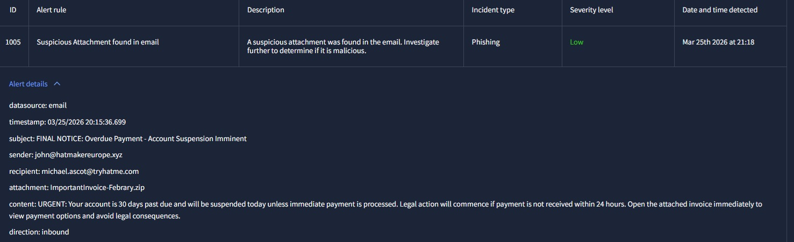
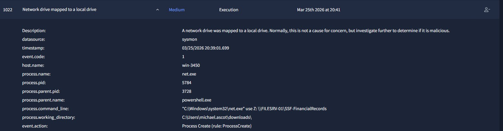
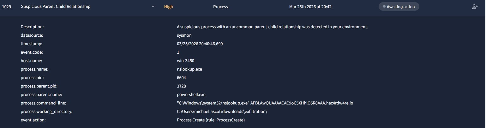

# 🔍 SOC Investigation – Phishing to Data Exfiltration via DNS

## 🧪 Lab Overview
This scenario simulates a real-world SOC investigation where a phishing email leads to a full compromise of an executive endpoint, followed by lateral movement, data staging, and data exfiltration.

---

## 🎯 Objective
- Identify True Positive alerts
- Reconstruct the attack chain
- Correlate events across multiple stages
- Understand attacker behavior

---

## 🧠 Scenario Summary
A phishing email containing a malicious ZIP attachment was delivered to the CEO.

After execution, the attacker gained access to the system, performed internal reconnaissance, accessed sensitive file shares, staged data locally, and exfiltrated it using DNS queries.

---

## 🛠 Tools & Techniques Observed
- PowerShell (execution)
- PowerView (reconnaissance)
- RDP (lateral movement)
- net.exe (network share access)
- robocopy (data staging)
- nslookup (DNS exfiltration)

---

## 🔄 Investigation Workflow

### 📌 1. Initial Access (Phishing)
A malicious email with a ZIP attachment triggered the compromise.

📸 Evidence:  

---

### 📌 2. Access to Internal Resources
The attacker mapped a network drive to access internal financial records.

📸 Evidence:  

This activity indicates unauthorized access to sensitive internal data via a legitimate Windows command.

---

### 📌 3. Data Staging
Sensitive data was collected locally before exfiltration.

The attacker used legitimate tools such as `robocopy` to organize and prepare files in a local directory.

This behavior is commonly observed before data exfiltration.

---

### 📌 4. Data Exfiltration (DNS)
The attacker exfiltrated data using DNS queries via `nslookup`.

📸 Evidence:  

This technique allows data to be hidden within DNS traffic, making detection more difficult.

---

### 📌 5. Cleanup
The attacker removed traces by disconnecting network drives after accessing internal resources.

This behavior is consistent with attempts to hide malicious activity.

---

## 🧩 Attack Chain Summary
1. Phishing email with malicious attachment
2. Execution via PowerShell
3. Internal reconnaissance (PowerView)
4. Lateral movement via RDP
5. Access to internal file shares
6. Data staging using robocopy
7. Data exfiltration via DNS (`nslookup`)
8. Cleanup of artifacts

---

## 📊 Results
- ✅ True Positive Rate: 100%
- ✅ False Positive Handling: 90%
- ⏱ Mean Time to Resolve: 1 minute
- 🕒 Mean Dwell Time: 14 minutes

---

## 💡 Key Takeaways
- Context is more important than individual alerts
- Legitimate tools (LOLBins) can be abused by attackers
- DNS can be used as a covert exfiltration channel
- Identifying patterns is key to reducing dwell time

---

## 🚀 Final Thoughts
This investigation highlights the importance of correlating multiple alerts to understand the full scope of an attack.

Rather than analyzing events in isolation, a SOC analyst must reconstruct attacker behavior across the entire attack chain.
